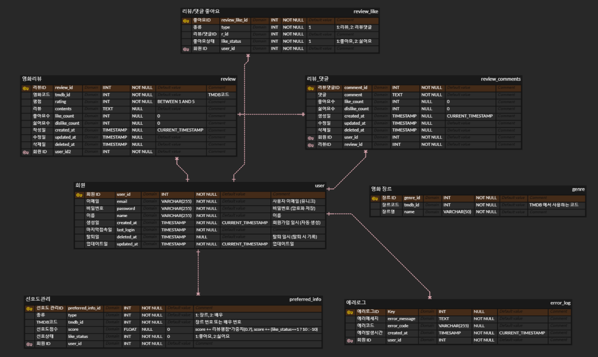

# Movie Recommendation App
사용자가 좋아할 만한 영화를 검색하고 추천받을 수 있는 플랫폼입니다.
기본적으로 TMDB API를 활용하여 영화 데이터베이스를 구축하고, 개인화된 추천 시스템을 통해 사용자에게 적합한 영화를 제공하는 서비스입니다.
추가적으로 사용자는 영화 리뷰를 작성하거나 다른 사용자와 의견을 공유할 수 있습니다.

### 기능
1. 사용자 관리
- 회원가입 및 로그인
- 프로필관리 (선호 장르 및 배우 입력)

2. 영화 검색 및 정보 조회
- 영화 검색 : 제목/장르 검색
- 인기 영화 및 최신 개봉 영화 목록 제공
- 영화 줄거리, 장르, 평점, 개봉일, 출연진 정보 제공

3. 추천 시스템
- 사용자의 선호도 기반 영화 추천
- 평점(★) 또는 관심 장르 기반 추천 목록 생성 (추후 추가 예정)
- 이번 주, 이번 달, 올해 인기 영화 리스트 제공

4. 리뷰 및 평점 기능
- 영화 리뷰 작성 및 보기
- 사용자별 영화 평점 제공

### ERD

### [TMDB API 문서](https://developer.themoviedb.org/docs/getting-started)

## 🛠️ 기술 스택

[//]: # ()

